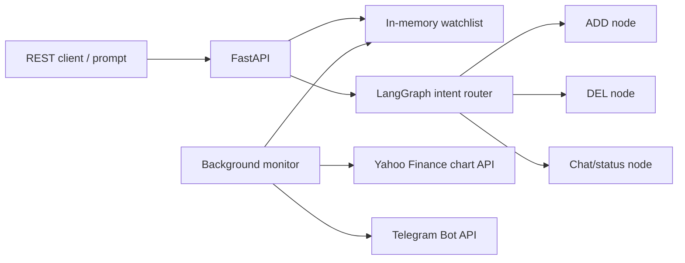

# LangGraph stock alert agent

Local agentic stock monitor with:

- REST endpoint to add symbols and variance thresholds
- in-memory watchlist database
- background price polling
- Telegram channel alerts
- LangGraph intent router for `ADD:`, `DEL:`, and chat/status prompts

## Setup

```bash
python3 -m venv .venv
source .venv/bin/activate
python3 -m pip install -r requirements.txt
cp .env.example .env
```

Edit `.env`:

```bash
TELEGRAM_BOT_TOKEN=123456:abc...
TELEGRAM_CHAT_ID=@your_channel_name
```

For a private channel, add the bot as an admin and use the channel id.

## Run locally

```bash
source .venv/bin/activate
uvicorn app.main:app --reload --host 127.0.0.1 --port 8000
```

Open:

```text
http://127.0.0.1:8000/docs
```

## REST examples

Add a stock monitor:

```bash
curl -X POST http://127.0.0.1:8000/watch \
  -H "Content-Type: application/json" \
  -d '{"symbol":"AAPL","variance":1.5}'
```

Ask the intent router to add:

```bash
curl -X POST http://127.0.0.1:8000/prompt \
  -H "Content-Type: application/json" \
  -d '{"prompt":"ADD: MSFT 2.0"}'
```

Ask the intent router to delete:

```bash
curl -X POST http://127.0.0.1:8000/prompt \
  -H "Content-Type: application/json" \
  -d '{"prompt":"DEL: AAPL"}'
```

Ask for status:

```bash
curl -X POST http://127.0.0.1:8000/prompt \
  -H "Content-Type: application/json" \
  -d '{"prompt":"What is my watchlist status?"}'
```

## How alerts work

The baseline price is set when a symbol is first added. The background monitor checks prices every `POLL_INTERVAL_SECONDS`. If the latest price moves up or down by at least the configured variance percentage from the last alert baseline, it sends a Telegram alert and resets the baseline to the new price.

## Architecture


