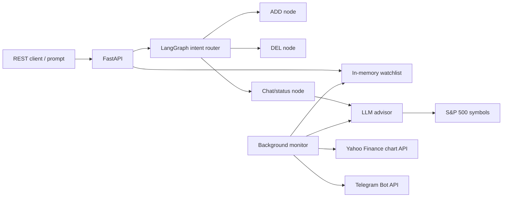

# LangGraph stock alert agent

Local agentic stock monitor with:

- REST endpoint to add symbols and variance thresholds
- in-memory watchlist database
- background price polling
- Telegram channel alerts
- one startup health report sent to Telegram
- LangGraph intent router for `ADD:`, `DEL:`, and chat/status prompts
- optional LLM analysis across the S&P 500 plus your watched symbols

## Setup

```bash
python3 -m venv .venv
source .venv/bin/activate
python3 -m pip install -r requirements.txt
cp .env.example .env
```

Edit `.env`:

```bash
TELEGRAM_BOT_TOKEN=123456:abc...
TELEGRAM_CHAT_ID=@your_channel_name
LLM_PROVIDER=ollama
OLLAMA_BASE_URL=http://127.0.0.1:11434
OLLAMA_MODEL=llama3.1
```

For a private channel, add the bot as an admin and use the channel id.

## Run locally

```bash
source .venv/bin/activate
uvicorn app.main:app --reload --host 127.0.0.1 --port 8000
```

Open:

```text
http://127.0.0.1:8000/docs
```

## REST examples

Add a stock monitor:

```bash
curl -X POST http://127.0.0.1:8000/watch \
  -H "Content-Type: application/json" \
  -d '{"symbol":"AAPL","variance":1.5}'
```

Ask the intent router to add:

```bash
curl -X POST http://127.0.0.1:8000/prompt \
  -H "Content-Type: application/json" \
  -d '{"prompt":"ADD: MSFT 2.0"}'
```

Ask the intent router to delete:

```bash
curl -X POST http://127.0.0.1:8000/prompt \
  -H "Content-Type: application/json" \
  -d '{"prompt":"DEL: AAPL"}'
```

Ask for status:

```bash
curl -X POST http://127.0.0.1:8000/prompt \
  -H "Content-Type: application/json" \
  -d '{"prompt":"What is my watchlist status?"}'
```

Get watchlist analysis with recommendations:

```bash
curl http://127.0.0.1:8000/status
```

Run LLM analysis immediately:

```bash
curl -X POST http://127.0.0.1:8000/analysis/run
```

## How alerts work

The baseline price is set when a symbol is first added. The background monitor checks prices every `POLL_INTERVAL_SECONDS`. If the latest price moves up or down by at least the configured variance percentage from the last alert baseline, it sends a Telegram alert and resets the baseline to the new price.

When the application starts, it sends one health report to Telegram with service status, LLM provider status, polling intervals, and current watchlist size. If Telegram is not configured or the send fails, the app still starts.

## How LLM recommendations work

The app periodically loads the S&P 500 constituent list from Wikipedia, adds any symbols in your in-memory watchlist, fetches compact quote snapshots from Yahoo Finance, and asks the configured LLM for `BUY`, `HOLD`, or `SELL` recommendations.

Only `BUY` and `SELL` recommendations with confidence of at least `0.55` are sent to Telegram. `HOLD` results are returned from `/analysis/run` but are not pushed as alerts.

Configuration:

```bash
LLM_PROVIDER=ollama
OLLAMA_BASE_URL=http://127.0.0.1:11434
OLLAMA_MODEL=llama3.1

# Or use OpenAI:
# LLM_PROVIDER=openai
OPENAI_API_KEY=sk-...
OPENAI_MODEL=gpt-4.1-mini

LLM_ANALYSIS_INTERVAL_SECONDS=3600
LLM_ANALYSIS_MAX_SYMBOLS=500
```

For local Ollama:

```bash
ollama pull llama3.1
ollama serve
```

If no usable LLM is configured, the service still runs. The chat route returns a deterministic watchlist summary, and the analysis endpoint uses a simple fallback momentum rule instead of an LLM.

This is an educational assistant, not financial advice.

## Design notes

The app uses a small dependency-injection container in `app/container.py`. It composes settings, storage, price providers, LLM providers, the advisor, Telegram, the monitor, and the LangGraph agent in one place.

This keeps `app/main.py` focused on HTTP routing and makes the core services easier to test or replace. For example, an Ollama client can be swapped for OpenAI without changing the advisor or API layer.

## Architecture


